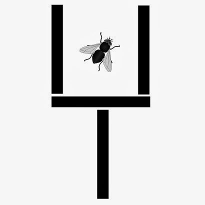
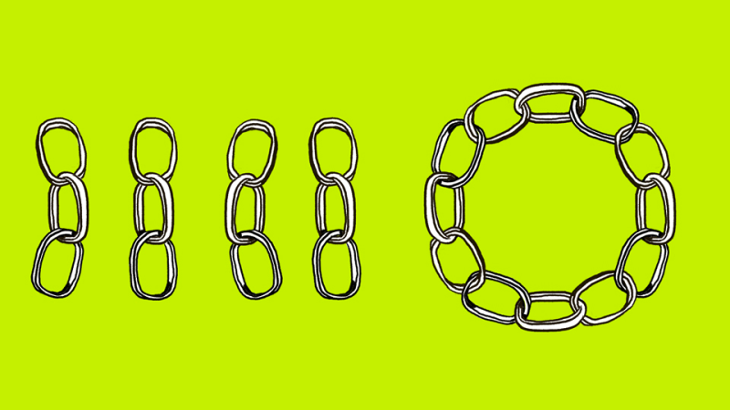

## Links
* [everything computer science](http://everythingcomputerscience.com/CSPuzzles.html)
* [puzzle toad](https://www.cs.cmu.edu/puzzle/)
* [xkcd riddles](http://wiki.xkcd.com/irc/Puzzles)


## 1. You walk 1 mile south, 1 mile west, and 1 mile north.  You end up at the same spot.  Where are you?
- 2 answers

## 2. Why do programmers confuse Halloween and Christmas?
- Because Oct 31 == Dec 25
- Simple answer and in depth answer

## 3. Only two people can go over the bridge at a time.  
It's dark, so the pair needs a flashlight to cross.  
Get all four people over the bridge in 17 minutes.  
A - 1 minute  
B - 2 minutes  
C - 5 minutes  
D - 10 minutes  

## 4. [balance puzzle](https://en.wikipedia.org/wiki/Balance_puzzle#The_nine-coin_problem)
There are 9 coins.  
8 weigh the same.  
1 weighs less.  
Using a scale, how many weighings does it take to find the lighter coin?

```
___         ___
 |           |
 -------------
       ^
```

###### todo json

```json
"9":{
      "id":9,
      "question":"There are 9 coins.\n8 weigh the same.\n1 weighs less.\nUsing a scale, how many weighings does it take to find the lighter coin?\n\n___         ___\n |           |\n -------------\n       ^",
      "answer":""
   }
```

## 5. Can you place 8 queens on a chess board such that no queens attack each other?

## 6. Alice wants to send Bob a message.
* Alice and Bob each have a padlock and key. Alice also has a box (which can be locked).
* How can Alice send a message to Bob securely?

## 7. Chicken, Fox, Grain
You have a fox, a chicken and a sack of grain. You must cross a river with only one of them at a time. If you leave the fox with the chicken he will eat it; if you leave the chicken with the grain he will eat it. How can you get all three across safely?

## 8. Lightbulbs
A windowless room contains three identical light fixtures, each containing an identical light bulb or light globe. Each light is connected to one of three switches outside of the room. Each bulb is switched off at present. You are outside the room, and the door is closed. You have one, and only one, opportunity to flip any of the external switches. After this, you can go into the room and look at the lights, but you may not touch the switches again. How can you tell which switch goes to which light?

## 9. How many games are played in a bracket?

## 10. How many times a day do clock hands overlap?

## 11. Lockers
There are 100 closed lockers. Toggling a locker means opening it if it's closed or closing it if it's open. First toggle each locker. Then toggle every 2nd locker, then every 3rd, every 4th… through to 100. How many lockers are open at the end? Why?

## 12. Move two match sticks to get the fly out of the wine glass. Must end up with a wine glass after moving the match sticks.
 

 
## 13. cognitive refleciton test (trick questions, but fun to ask at a fast pace) :
1) a bat and a ball cost $1.10, the bat costs $1 more than the ball
2) If it takes 5 machines 5 minutes to make 5 widgets, how long would it take 100 machines to make 100 widgets
3) In a lake, there is a patch of lily pads. Every day, the patch doubles in size. If it takes 48 days for the patch to cover the entire lake, how long would it take to cover half the lake?

## 14. Two ropes burn an hour each. How can you measure:
a) 2 hours  
b) Hour and a half  
c) 45 min  
*(Note: the ropes have “uneven” burn rates throughout, i.e. we should not light it in the middle)*

## 15. Links
Join the four three-link chains on the left to form the circular chain on the right. To join two chains, you must cut, and then re-weld, a link. How do you form the circle in three cuts.



## 16. Why do Americans have more freckles on the left side of their face?

## 17. https://en.wikipedia.org/wiki/Prisoners_and_hats_puzzle

## 18. Water Jug

You have a 3-gallon and a 5-gallon jug that you can fill from a fountain of water.

How do you get exactly 4 gallons

## 19. Lily pads
There is a pond with lily pads in it. Every day the amount of lily pads in the pond doubles. (2,4,8,16,32, etc.) If on the 30th day the pond is completely full, on which day was it half full?

## 20. Dumbass, M.D.

From http://www.defectiveyeti.com/archives/000339.html  

You have Some Terminal Disease, which necessitates taking two pills a day: one Pill A and one Pill B. If you neglect to take either pill, you die; if you take more than one A or more than one B, you die. If you don't take them at exactly the same time, you die.  

This morning you are going through your usual routine. You pick up your bottle of A Pills and gently tap one into your palm. Then you pick up your bottle of B Pills and tap it, but two pills accidentally fall into your hand. You now hold three pills (one A and two Bs), you don't know which are which, and they are completely indistinguishable from each other. The A Pills are the same color as the B Pills, they are the same shape, same size -- they appear identical in every respect. Man, your doctor is a dumbass. But he's a rich dumbass, because he's charging you $10,000,000 a pill! So you dare not throw any away.
Thus, the puzzle: what can you do to ensure that you take only one A Pill and only one B Pill today, without wasting any pills (either today or in the future)?

**Note:** Counting the remaining pills in both bottles is not the solution.

## 21. String around Earth

Tie a string around the Earth.  Then raise the string off the ground by 1 meter.  How much longer must the string be?

## 22. [Wheat and chessboard problem](https://en.wikipedia.org/wiki/Wheat_and_chessboard_problem)
If a chessboard were to have wheat placed upon each square such that one grain were placed on the first square, two on the second, four on the third, and so on (doubling the number of grains on each subsequent square), how many grains of wheat would be on the chessboard at the finish?

## 23. [Fruit Jar Problem](https://www.techinterview.org/post/3233459687/fruit-jar-problem/)

You have 3 jars that are all mislabeled. One jar contains Apple, another contains Oranges and the third jar contains a mixture of both Apple and Oranges. You are allowed to pick as many fruits as you want from each jar to fix the labels on the jars. What is the minimum number of fruits that you have to pick and from which jars to correctly label them?

## 24. Hats & Prisoners

Their are 10 prisoners standing in a line *(facing forward)*.  Each prisoner has either a black or white hat and can only see the prisoners in front of them.  If at least 9 prisoners guess the color of their own hat, they all go free.  What strategy will give the greatest chance of going free?

## 25. [Pirates](https://www.youtube.com/watch?v=Mc6VA7Q1vXQ)

## 26. [Temple](https://www.youtube.com/watch?v=nSbvlktToSY)

## 27. [Virus](https://www.youtube.com/watch?v=ZKh6z0X6KRw)

## 28. [River Crossing](https://www.youtube.com/watch?v=ADR7dUoVh_c)
* 3 lions & 3 wildebeest

## 29. [Airplane around the world](https://www.youtube.com/watch?v=dzrwnwOx0fw)

## 30. [Gold for 7 days of work](http://www.mytechinterviews.com/gold-for-7-days-of-work)

You’ve got someone working for you for seven days and a gold bar to pay them. You must pay the worker for their work at the end of every day. If you are only allowed to make two breaks in the gold bar, how do you pay your worker? (Assuming equal amount of work is done during each day thus requiring equal amount of pay for each day)
